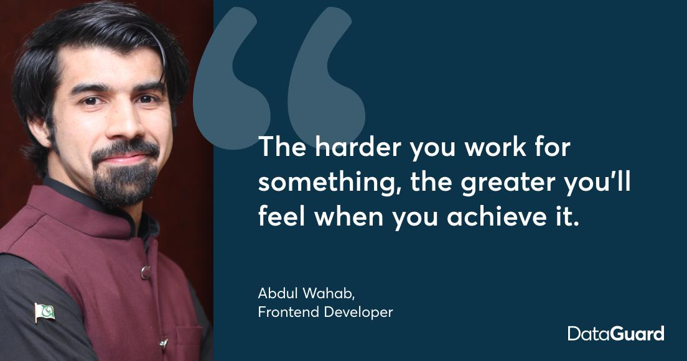

<h1>Hi Traveller, I am <a href="https://abdulwahab0.github.io/Portfolio/#/home">Abdul Wahab </a></h1>

<h3>What I do? 👨‍💻</h3>

Frontend Developer

Full Stack Developer 🍥 (Only Basic Level)

<h3>The Questions You May Have 😕</h3>

  
Who are you? 👨

  <pre>
  A highly organized, dynamic and enthusiastic Freshly Graduated Master in Computer Science and IT professional with 1.5 year of experience in web development with Testing and technology support with a strong emphasis on frontend Technologies and some Backend Technologies.Detailed oriented with strong problem-solving, work ethics, communication, interpersonal and teamwork skill.. 
  My name describes my qualities,
  A: Active Learner
  B: Bashful (Shy )
  D: Developer
  U: Unique
  L: Active Lisner
  </pre>

What do you do other than building Web developmnet systems? 💁‍♂️

  <ul>
    <li>I write blogs about powerful lessons in personal changes. You can visit my blog site at <a href="https://www.linkedin.com/pulse/data-scientist-sexiest-job-21st-century-abdul-wahab/?articleId=6326891767505526785#comments-6326891767505526785&trk=public_profile-settings_article_view">Abdul's Blog</a>.</li>
    <li>I have worked as a public Event Manager in Berlin and a member of the Pakistan Embassy Berlin Event Team. We work for Pakistani students issues and manage all Pakistani culture Base events</li>
    <li>I design, build, and deploy interactive websites. Whenever I am free, I try to create web designs in Figma.</li>
  </ul>

<h3>What if you like my work? 🤩</h3>
<ul>
  <li>Subscribe to my <a href="#">YouTube Channel (coming soon)</a>.</li>
  <li>You can Star ⭐ the repositories you like.</li>
  <li>You can react ❤️ to my LinkedIn posts.</li>
</ul>

